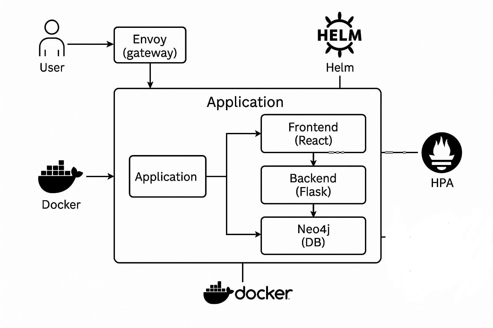

# Fan Treasure – MVP en Kubernetes (Helm + Envoy + Neo4j)

Este repositorio contiene el **MVP de Fan Treasure** adaptado a **Kubernetes**:
- Despliegue con **Helm** (chart `charts/geekstore`).
- **Gateway Envoy** para enrutar `/api/*` → backend (Flask/Gunicorn) y `/` → frontend (React/Nginx).
- **Neo4j** como **StatefulSet** con **PVC** y **Secret** de credenciales.
- **HPA** para backend y frontend (autoscaling por CPU).
- Instrucciones para **Minikube + Docker Desktop (sin WSL2)** en Windows. (También funciona en Linux/macOS).

---

## 1) Requisitos

- **Docker Desktop** (Running) – sin WSL2 es válido.
- **kubectl** y **Helm** instalados.
- **Minikube** (driver `docker` recomendado).
- (Opcional) **git** para clonar/subir a GitHub.

Comprueba versiones:
```powershell
docker --version
kubectl version --client
helm version
minikube version
```

---

## 2) Arrancar el clúster y métricas

```powershell
minikube start --driver=docker --cpus=4 --memory=8192

# Habilitar métricas (para HPA)
minikube addons enable metrics-server
kubectl top nodes    # si aún no está disponible, espera 1–2 min
```

> Si necesitas el patch típico del metrics-server, consulta la sección de *Troubleshooting*.

---

## 3) Construir imágenes

### Opción A — Build local y cargar al clúster
```powershell
# Backend (Flask + Gunicorn)
cd backend
docker build -t backend:0.1.1 -f Dockerfile.k8s .
minikube image load backend:0.1.1

# Frontend (React + Nginx)
cd ..\frontend
docker build -t frontend:0.1.3 -f Dockerfile.k8s .
minikube image load frontend:0.1.3
```

### Opción B — Build directo en el daemon de Minikube
```powershell
& minikube -p minikube docker-env --shell powershell | Invoke-Expression

cd mvp\backend
docker build -t backend:0.1.1 -f Dockerfile.k8s .

cd ..\frontend
docker build -t frontend:0.1.3 -f Dockerfile.k8s .
```

---

## 4) Despliegue con Helm

Desde la **raíz del repo** (donde está `charts\geekstore`):

```powershell
helm upgrade --install geekstore charts/geekstore -n geek --create-namespace `
  --set images.backend=backend:0.1.1 `
  --set images.frontend=frontend:0.1.3
kubectl get pods -n geek -w
```

> Si cambiaste tags, actualízalos con `--set images.*=` como arriba.

---

## 5) Probar la app

### Port-forward del gateway
```powershell
kubectl -n geek port-forward svc/envoy 18080:8080
```
- Frontend → http://localhost:18080/
- API (ajusta al endpoint real) → `http://localhost:18080/api/...`

### (Opcional) NodePort rápido
```powershell
kubectl -n geek patch svc envoy -p '{"spec":{"type":"NodePort","ports":[{"port":8080,"targetPort":8080,"nodePort":30080}]}}'
minikube ip
# Abre: http://<IP_MINIKUBE>:30080/
```

---

## 6) Configuración de Neo4j

Credenciales por defecto (Secret `neo4j-auth`):
- `NEO4J_USER=neo4j`
- `NEO4J_PASSWORD=password`
- `NEO4J_AUTH=neo4j/password`

Para cambiarlas:
```powershell
kubectl -n geek create secret generic neo4j-auth `
  --from-literal=NEO4J_USER=neo4j `
  --from-literal=NEO4J_PASSWORD=TU_PASS `
  --from-literal=NEO4J_AUTH="neo4j/TU_PASS" `
  -o yaml --dry-run=client | kubectl apply -f -

kubectl -n geek rollout restart statefulset/neo4j
kubectl -n geek rollout restart deploy/backend
```

El backend usa variables:
- `NEO4J_URI` (por defecto `neo4j://neo4j:7687`, configurada vía `values.yaml`)
- `NEO4J_USER` y `NEO4J_PASSWORD` (desde el Secret).

---

## 7) HPA (autoscaling)

Comprueba que estén creados:
```powershell
kubectl -n geek get hpa
kubectl top pods -n geek
```

Genera carga (PowerShell) hacia un endpoint del backend:
```powershell
$u="http://localhost:18080/api/tu-endpoint"
1..400 | % { iwr $u -UseBasicParsing | Out-Null }
kubectl -n geek get hpa -w
```

---

## 8) Estructura del repo

```
mvp/
  backend/
    app.py
    Dockerfile.k8s
    requirements.txt
  frontend/
    app/
      public/
      src/
    Dockerfile.k8s
    nginx.conf
charts/
  geekstore/
    Chart.yaml
    values.yaml
    templates/
      deployment-backend.yaml
      service-backend.yaml
      hpa-backend.yaml
      deployment-frontend.yaml
      service-frontend.yaml
      hpa-frontend.yaml
      statefulset-neo4j.yaml
      secret-neo4j.yaml
      cm-envoy.yaml
      deployment-envoy.yaml
      service-envoy.yaml
```

---

## 9) Troubleshooting rápido

- **ImagePullBackOff (backend/frontend)**  
  Carga las imágenes al clúster:
  ```powershell
  minikube image load mvp/backend:0.1.1
  minikube image load mvp/frontend:0.1.3
  kubectl -n geek rollout restart deploy/backend deploy/frontend
  ```

- **Envoy CrashLoopBackOff**  
  Usa `typed_config` en `envoy.yaml` para `envoy.filters.http.router`. Si editas el chart, corre `helm upgrade` después.

- **Metrics API not available**  
  Espera 1–2 min tras `minikube addons enable metrics-server`. Si hiciera falta:
  ```powershell
  kubectl -n kube-system patch deployment metrics-server --type='json' -p='[
    {"op":"replace","path":"/spec/template/spec/containers/0/args","value":[
      "--cert-dir=/tmp","--secure-port=4443",
      "--kubelet-preferred-address-types=InternalIP,Hostname,InternalDNS,ExternalDNS,ExternalIP",
      "--kubelet-use-node-status-port","--metric-resolution=15s","--kubelet-insecure-tls"
    ]}
  ]'
  kubectl -n kube-system rollout status deploy/metrics-server
  ```

- **Frontend “Loading…”**  
  Evita `fallback="Loading..."` y usa un **fondo por defecto** mientras se carga `/api/random-background`.

---

## 10) Limpieza

```powershell
helm uninstall geekstore -n geek
minikube delete
```
## 11) Arquitectura


---
